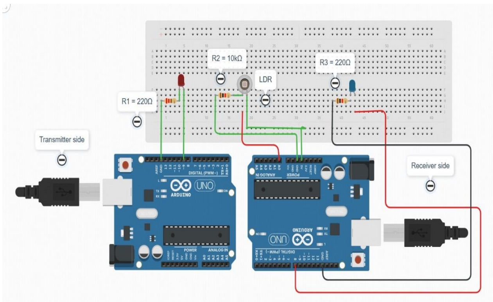

# LiFi-Based Visible Light Communication System

This project demonstrates a simple **Visible Light Communication (LiFi) system** using Arduino boards. Data is transmitted wirelessly by modulating the intensity of an LED, and the signal is received using a Light Dependent Resistor (LDR).

The project illustrates how **visible light can be used as a communication medium**, similar to radio-frequency wireless systems.

---

## System Overview

The system consists of two main parts:

### Transmitter
An Arduino controls an LED whose light intensity is modulated according to the message signal.

### Receiver
An LDR detects variations in the LED light intensity. The received signal is processed by another Arduino and indicated using an LED.

---

## Circuit Diagram

---

## Components Used

### Transmitter Side
- Arduino UNO
- LED (Transmitting LED)
- Resistor **R1 = 220 Ω**
- Breadboard
- Connecting wires

### Receiver Side
- Arduino UNO
- Light Dependent Resistor (LDR)
- Resistor **R2 = 10 kΩ** (voltage divider)
- LED (Receiver indicator)
- Resistor **R3 = 220 Ω**
- Breadboard
- Connecting wires

---

## Working Principle

1. The **transmitter Arduino** sends a signal to the LED.
2. The LED’s **light intensity is modulated** according to the transmitted signal.
3. The light travels through free space.
4. The **LDR detects variations in light intensity**.
5. The receiver Arduino processes the signal and drives an **indicator LED** to represent the received data.

---

## Key Concepts Demonstrated

- Visible Light Communication (VLC)
- Optical wireless communication
- Signal modulation using LED
- Light sensing using LDR
- Arduino-based embedded system design

---

## Applications

- LiFi communication systems
- Optical wireless communication
- Secure indoor communication
- IoT device communication using light

---

## Future Improvements\

- Increase transmission distance
- Implement higher data rate communication
- Use photodiodes instead of LDR for faster response
- Implement digital encoding techniques

---

## Author

Aryan Kose  
